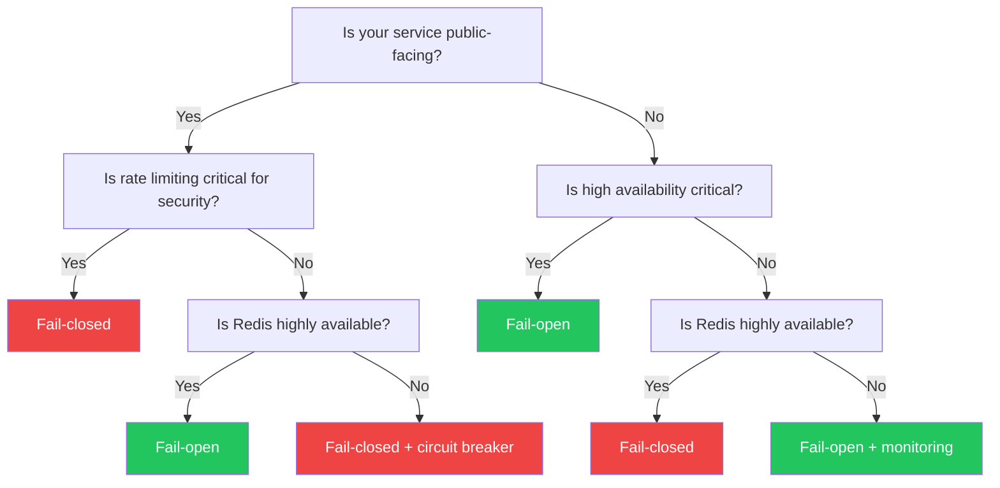

When your Redis instance becomes unavailable (network partition, server crash, maintenance), the rate limiter needs to decide: should it allow all requests through (**fail-open**) or deny all requests (**fail-closed**)?

This decision has significant implications for your application's availability and security.

## The tradeoff

<CardGroup cols={2}>
  <Card title="Fail-closed" icon="lock" color="#ef4444">
    **Deny requests when Redis is down**
    
    - Pros: Prevents abuse, maintains security
    - Cons: Reduces availability, may cause outages
  </Card>
  
  <Card title="Fail-open" icon="lock-open" color="#22c55e">
    **Allow requests when Redis is down**
    
    - Pros: Maintains availability, better user experience
    - Cons: Temporarily unprotected from abuse
  </Card>
</CardGroup>

<Warning>
Choosing between fail-open and fail-closed is a fundamental architectural decision. There's no universal "right" answer—it depends on your specific requirements.
</Warning>

## Configuration

You can configure the failure strategy using `RateLimiterProperties` (config/RateLimiterProperties.java:21-26):

<Tabs>
  <Tab title="application.properties">
    ```properties
    # Fail-closed (default): deny requests when Redis is down
    ratelimiter.fail-open=false
    
    # Fail-open: allow requests when Redis is down
    ratelimiter.fail-open=true
    ```
  </Tab>
  
  <Tab title="application.yml">
    ```yaml
    ratelimiter:
      fail-open: false  # fail-closed (default)
      # OR
      fail-open: true   # fail-open
    ```
  </Tab>
  
  <Tab title="Java Config">
    ```java
    @Configuration
    public class RateLimiterConfig {
        
        @Bean
        public RateLimiterProperties rateLimiterProperties() {
            RateLimiterProperties props = new RateLimiterProperties();
            props.setFailOpen(true);  // or false
            return props;
        }
    }
    ```
  </Tab>
</Tabs>

<Info>
The default behavior is **fail-closed** (`failOpen = false`). This is the more conservative choice that protects your backend from abuse.
</Info>

## How it works

The `RedisRateLimiter` wraps all Redis operations in a try-catch block (redis/RedisRateLimiter.java:59-78):

```java
try {
    long currentCount = increment(redisKey, resolvedPolicy.getWindow().plus(TTL_SAFETY_BUFFER));
    boolean allowed = currentCount <= resolvedPolicy.getLimit();
    // ... return normal decision
    return new RateLimitDecision(allowed, remainingTime, retryAfter, resetAfter);
    
} catch (RuntimeException ex) {
    if (failOpen) {
        // Fail-open: allow the request
        return new RateLimitDecision(
            true,                                    // allowed = true
            RateLimitDecision.REMAINING_TIME_UNKNOWN, // -1 (unknown)
            null,                                    // no retry needed
            Duration.ofMillis(resetAfterMillis)     // estimated reset time
        );
    }
    // Fail-closed: throw exception
    throw new RateLimiterBackendException("Redis rate limiter backend failure for key: " + redisKey, ex);
}
```

<Steps>
  <Step title="Normal operation">
    Redis operations succeed, and the rate limiter returns a decision based on the current count
  </Step>
  
  <Step title="Redis failure detected">
    Any `RuntimeException` from Redis (connection timeout, command failure, etc.) is caught
  </Step>
  
  <Step title="Check fail-open setting">
    If `failOpen = true`, return an "allowed" decision with `REMAINING_TIME_UNKNOWN` (-1)
    
    If `failOpen = false`, wrap and rethrow as `RateLimiterBackendException`
  </Step>
</Steps>

## Fail-open behavior details

When failing open, the limiter returns a special decision object (redis/RedisRateLimiter.java:70-75):

```java
return new RateLimitDecision(
    true,                                    // allowed = true
    RateLimitDecision.REMAINING_TIME_UNKNOWN, // -1 (indicates unknown state)
    null,                                    // no retryAfter
    Duration.ofMillis(resetAfterMillis)     // estimated resetAfter
);
```

<ResponseField name="allowed" type="boolean">
  Always `true`—the request is allowed through
</ResponseField>

<ResponseField name="remainingTime" type="long">
  Set to `REMAINING_TIME_UNKNOWN` (-1) to indicate the rate limiter couldn't determine the actual remaining time
</ResponseField>

<ResponseField name="retryAfter" type="Duration">
  `null`—no retry is needed since the request was allowed
</ResponseField>

<ResponseField name="resetAfter" type="Duration">
  An estimated reset time based on the policy's window duration (may not be accurate since we couldn't contact Redis)
</ResponseField>

<Tip>
Monitor the `remainingTime` field in your metrics. If you see `-1` values, it means the rate limiter is failing open due to Redis issues.
</Tip>

## Fail-closed behavior details

When failing closed, the limiter throws a `RateLimiterBackendException` (exception/RateLimiterBackendException.java):

```java
throw new RateLimiterBackendException(
    "Redis rate limiter backend failure for key: " + redisKey, 
    ex  // original Redis exception
);
```

This exception propagates up to your application, where it can be handled by:

1. **Spring's exception handler** (exception/RateLimitExceptionHandler.java)—returns HTTP 503 Service Unavailable
2. **Your custom error handler**—implement custom logic
3. **Circuit breaker**—detect repeated failures and short-circuit

<Note>
`RateLimiterBackendException` is a `RuntimeException`, so it will cause the method call to fail unless caught.
</Note>

## Decision tree: Which strategy to use?



## Use case recommendations

<AccordionGroup>
  <Accordion title="Public API with abuse prevention">
    **Recommendation: Fail-closed**
    
    If your rate limiter is primarily for preventing abuse (DDoS, scraping, brute-force attacks), failing closed ensures that a Redis outage doesn't leave you vulnerable.
    
    ```yaml
    ratelimiter:
      fail-open: false  # Fail-closed
    ```
    
    **Mitigation:** Run Redis in a highly available configuration (Redis Sentinel, Redis Cluster, or managed service like ElastiCache/Azure Redis).
  </Accordion>
  
  <Accordion title="Internal API with fair-use limits">
    **Recommendation: Fail-open**
    
    If your rate limiter is for fair-use enforcement among internal clients (not security-critical), failing open maintains availability.
    
    ```yaml
    ratelimiter:
      fail-open: true  # Fail-open
    ```
    
    **Mitigation:** Monitor Redis health and set up alerts for fail-open events.
  </Accordion>
  
  <Accordion title="Paid API with billing tiers">
    **Recommendation: Fail-closed**
    
    If rate limits are tied to billing/quotas, failing open could result in over-consumption without payment.
    
    ```yaml
    ratelimiter:
      fail-open: false  # Fail-closed
    ```
    
    **Mitigation:** Use multiple Redis instances, implement circuit breakers, and provide a status page.
  </Accordion>
  
  <Accordion title="High-availability requirement">
    **Recommendation: Fail-open + Multi-region Redis**
    
    If your SLA requires 99.99% uptime, failing closed on Redis outages is not acceptable.
    
    ```yaml
    ratelimiter:
      fail-open: true  # Fail-open
    ```
    
    **Mitigation:** Use geo-replicated Redis, implement fallback rate limiting (in-memory), and monitor closely.
  </Accordion>
</AccordionGroup>

## Best practices

<CardGroup cols={2}>
  <Card title="Monitor fail-open events" icon="chart-line">
    Track when `remainingTime == -1` in your metrics to detect Redis issues early
  </Card>
  
  <Card title="Use high-availability Redis" icon="server">
    Redis Sentinel, Redis Cluster, or managed services provide automatic failover
  </Card>
  
  <Card title="Implement circuit breakers" icon="bolt">
    Prevent cascading failures by short-circuiting after repeated Redis errors
  </Card>
  
  <Card title="Set up alerts" icon="bell">
    Alert on-call engineers when the rate limiter throws `RateLimiterBackendException`
  </Card>
</CardGroup>

## Monitoring and observability

### Detecting fail-open events

If you're using Micrometer metrics (enabled by default), you can detect fail-open events:

```java
// In your custom metrics recorder or monitoring system
if (decision.getRemainingTime() == RateLimitDecision.REMAINING_TIME_UNKNOWN) {
    meterRegistry.counter("ratelimiter.failopen.count", 
        "endpoint", methodName
    ).increment();
    
    log.warn("Rate limiter failed open for {}: Redis unavailable", methodName);
}
```

### Alerting on fail-closed events

When failing closed, the `RateLimiterBackendException` should trigger alerts:

```java
@ControllerAdvice
public class RateLimiterExceptionHandler {
    
    @ExceptionHandler(RateLimiterBackendException.class)
    public ResponseEntity<ErrorResponse> handleBackendException(RateLimiterBackendException ex) {
        // Alert your monitoring system
        alertingService.sendAlert("Redis rate limiter failure", ex.getMessage());
        
        // Return 503 Service Unavailable
        return ResponseEntity
            .status(HttpStatus.SERVICE_UNAVAILABLE)
            .body(new ErrorResponse("Rate limiting service temporarily unavailable"));
    }
}
```

### Custom error handler example

You can implement custom logic when Redis fails:

```java
import io.github.v4runsharma.ratelimiter.core.RateLimiter;
import io.github.v4runsharma.ratelimiter.exception.RateLimiterBackendException;
import io.github.v4runsharma.ratelimiter.model.RateLimitDecision;
import io.github.v4runsharma.ratelimiter.model.RateLimitPolicy;
import io.github.micrometer.core.instrument.Counter;
import io.github.micrometer.core.instrument.MeterRegistry;

public class MonitoredRedisRateLimiter implements RateLimiter {
    
    private final RateLimiter delegate;
    private final MeterRegistry meterRegistry;
    private final Counter failOpenCounter;
    private final Counter failClosedCounter;
    
    public MonitoredRedisRateLimiter(RateLimiter delegate, MeterRegistry meterRegistry) {
        this.delegate = delegate;
        this.meterRegistry = meterRegistry;
        this.failOpenCounter = meterRegistry.counter("ratelimiter.failopen");
        this.failClosedCounter = meterRegistry.counter("ratelimiter.failclosed");
    }
    
    @Override
    public RateLimitDecision evaluate(String key, RateLimitPolicy policy) {
        try {
            RateLimitDecision decision = delegate.evaluate(key, policy);
            
            // Detect fail-open
            if (decision.isAllowed() && 
                decision.getRemainingTime() == RateLimitDecision.REMAINING_TIME_UNKNOWN) {
                failOpenCounter.increment();
            }
            
            return decision;
            
        } catch (RateLimiterBackendException ex) {
            // Detect fail-closed
            failClosedCounter.increment();
            throw ex;
        }
    }
}
```

## Advanced: Hybrid approach

For maximum resilience, you can implement a hybrid approach:

1. **Primary:** Redis rate limiter
2. **Fallback:** In-memory rate limiter (e.g., Guava Cache, Caffeine)

```java
@Component
public class HybridRateLimiter implements RateLimiter {
    
    private final RedisRateLimiter redisLimiter;
    private final InMemoryRateLimiter fallbackLimiter;
    private final CircuitBreaker circuitBreaker;
    
    @Override
    public RateLimitDecision evaluate(String key, RateLimitPolicy policy) {
        // Try Redis first if circuit breaker is closed
        if (circuitBreaker.isAvailable()) {
            try {
                return redisLimiter.evaluate(key, policy);
            } catch (RateLimiterBackendException ex) {
                circuitBreaker.recordFailure();
                log.warn("Redis unavailable, falling back to in-memory rate limiter");
            }
        }
        
        // Fall back to in-memory limiter
        return fallbackLimiter.evaluate(key, policy);
    }
}
```

<Warning>
In-memory rate limiting only works within a single instance. If you have multiple application instances, each will have its own counter. This means the effective limit is multiplied by the number of instances.
</Warning>

## Comparison table

| Aspect | Fail-Open | Fail-Closed |
|--------|-----------|-------------|
| **Availability** | High—requests continue flowing | Low—requests blocked during outage |
| **Security** | Low—temporarily unprotected | High—abuse prevented |
| **User experience** | Good—no service disruption | Poor—errors during outage |
| **Redis dependency** | Optional (graceful degradation) | Critical (hard dependency) |
| **Suitable for** | Internal APIs, fair-use limits | Public APIs, abuse prevention, billing |
| **Monitoring needs** | High—must detect fail-open events | Medium—fail-closed is obvious |

## Testing failure scenarios

You should test your application's behavior when Redis fails:

### Test 1: Redis connection timeout

```bash
# Block Redis port with iptables
sudo iptables -A OUTPUT -p tcp --dport 6379 -j DROP

# Make requests to your API
curl http://localhost:8080/api/data

# Restore connection
sudo iptables -D OUTPUT -p tcp --dport 6379 -j DROP
```

### Test 2: Redis server crash

```bash
# Stop Redis
docker stop redis

# Make requests
curl http://localhost:8080/api/data

# Restart Redis
docker start redis
```

### Expected behavior

<Tabs>
  <Tab title="Fail-open">
    - Requests should succeed (HTTP 200)
    - Response headers should not include rate limit info
    - Logs should show warnings about Redis unavailability
    - Metrics should show `failopen.count` increasing
  </Tab>
  
  <Tab title="Fail-closed">
    - Requests should fail (HTTP 503 Service Unavailable)
    - Response should include error message about rate limiting unavailable
    - Logs should show `RateLimiterBackendException`
    - Metrics should show `failclosed.count` increasing
  </Tab>
</Tabs>

## Next steps

<CardGroup cols={2}>
  <Card title="Overview" href="/concepts/overview" icon="book">
    Learn about the overall architecture
  </Card>
  <Card title="Rate limiting algorithm" href="/concepts/rate-limiting" icon="clock">
    Understand the fixed-window algorithm
  </Card>
  <Card title="Key resolution" href="/concepts/key-resolution" icon="key">
    Customize how rate limit keys are generated
  </Card>
</CardGroup>