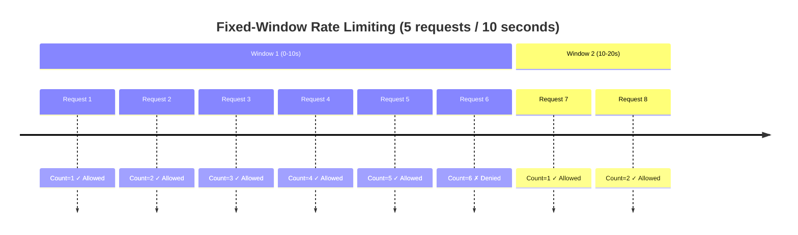

The Spring Boot Redis Rate Limiter implements a **fixed-window** rate limiting algorithm using Redis atomic operations. This algorithm is simple, efficient, and provides strong consistency guarantees.

## Fixed-window algorithm

The fixed-window algorithm divides time into discrete, non-overlapping windows of fixed duration. Each window has its own counter that tracks the number of requests.

### How it works

<Steps>
  <Step title="Window boundary calculation">
    Calculate the start of the current window by rounding down the current timestamp to the nearest window boundary:
    ```java
    long windowStartMillis = nowMillis - (nowMillis % windowMillis);
    ```
    This ensures all requests in the same time window use the same Redis key.
  </Step>
  
  <Step title="Atomic increment">
    Increment the counter for the current window using Redis `INCR`:
    ```java
    Long count = redisTemplate.opsForValue().increment(redisKey);
    ```
  </Step>
  
  <Step title="TTL on first request">
    When the counter is first created (count == 1), set an expiration time:
    ```java
    if (count == 1L) {
        redisTemplate.expire(redisKey, windowDuration + 1 second);
    }
    ```
  </Step>
  
  <Step title="Allow or deny">
    Compare the count against the limit and return a decision:
    ```java
    boolean allowed = count <= policy.getLimit();
    ```
  </Step>
</Steps>

## Visual example

Consider a rate limit of **5 requests per 10 seconds**:



At the 10-second boundary, the counter resets (the old Redis key expires), and a new window begins.

<Warning>
Fixed-window algorithms can allow up to **2× the limit** at window boundaries. For example, if the limit is 10/minute, a client could make 10 requests at 00:00:59 and 10 more at 00:01:00, totaling 20 requests in 2 seconds.
</Warning>

## Redis implementation details

The `RedisRateLimiter` class (redis/RedisRateLimiter.java:19) uses a carefully designed Redis key structure and operations.

### Key structure

Each rate limit window is stored in Redis with a key format:

```
{prefix}:{resolvedKey}:{windowStartMillis}
```

**Example:**
```
ratelimiter:global:com.example.ApiController#getData:1678900820000
```

<Accordion title="Key components breakdown">
- **prefix**: Configurable namespace (default: `ratelimiter`)
- **resolvedKey**: The key generated by your `RateLimitKeyResolver` (e.g., `global:com.example.ApiController#getData`)
- **windowStartMillis**: The timestamp of the window start in milliseconds (e.g., `1678900820000`)
</Accordion>

### Redis operations

The limiter performs two Redis operations per request:

<CodeGroup>
```redis INCR (Atomic increment)
INCR ratelimiter:global:com.example.ApiController#getData:1678900820000
// Returns: 1 (or current count)
```

```redis EXPIRE (Set TTL on first request)
EXPIRE ratelimiter:global:com.example.ApiController#getData:1678900820000 61
// Only executed when count == 1
```
</CodeGroup>

<Info>
The TTL is set to `window duration + 1 second` as a safety buffer. This prevents edge cases where a key might be accessed after its intended expiration.
</Info>

## Window boundary calculation

Here's how the algorithm calculates window boundaries from the source code (redis/RedisRateLimiter.java:54-56):

```java
long nowMillis = clock.millis();
long windowStartMillis = nowMillis - (nowMillis % windowMillis);
long resetAfterMillis = Math.max(1L, windowMillis - (nowMillis - windowStartMillis));
```

### Example calculation

For a **60-second window** at timestamp `1,678,900,825,000` milliseconds:

<Steps>
  <Step title="Current time">
    ```
    nowMillis = 1,678,900,825,000
    ```
  </Step>
  
  <Step title="Window duration">
    ```
    windowMillis = 60,000 (60 seconds)
    ```
  </Step>
  
  <Step title="Calculate window start">
    ```
    windowStartMillis = 1,678,900,825,000 - (1,678,900,825,000 % 60,000)
                      = 1,678,900,825,000 - 5,000
                      = 1,678,900,820,000
    ```
  </Step>
  
  <Step title="Calculate reset time">
    ```
    resetAfterMillis = 60,000 - (1,678,900,825,000 - 1,678,900,820,000)
                     = 60,000 - 5,000
                     = 55,000 (55 seconds until window resets)
    ```
  </Step>
</Steps>

<Tip>
All clients using the same key will calculate the same `windowStartMillis`, ensuring they all use the same Redis key. This is what makes the algorithm distributed-safe.
</Tip>

## Rate limit decision

After incrementing the counter, the limiter constructs a `RateLimitDecision` object (redis/RedisRateLimiter.java:61-67):

```java
long currentCount = increment(redisKey, resolvedPolicy.getWindow().plus(TTL_SAFETY_BUFFER));
boolean allowed = currentCount <= resolvedPolicy.getLimit();

Duration resetAfter = Duration.ofMillis(resetAfterMillis);
Duration retryAfter = allowed ? null : resetAfter;

return new RateLimitDecision(allowed, remainingTime, retryAfter, resetAfter);
```

### Decision fields

<ResponseField name="allowed" type="boolean">
  Whether the request should be allowed through
</ResponseField>

<ResponseField name="remainingTime" type="long">
  Milliseconds until the rate limit resets (0 if allowed, or time until window expires if denied)
</ResponseField>

<ResponseField name="retryAfter" type="Duration">
  Duration the client should wait before retrying (null if allowed, equals resetAfter if denied)
</ResponseField>

<ResponseField name="resetAfter" type="Duration">
  Duration until the current window expires and the counter resets
</ResponseField>

## Performance characteristics

<CardGroup cols={2}>
  <Card title="Time complexity" icon="clock">
    **O(1)** - Only two Redis operations per request (INCR + EXPIRE)
  </Card>
  
  <Card title="Space complexity" icon="database">
    **O(K × W)** - K unique keys × W active windows. Keys auto-expire via TTL.
  </Card>
  
  <Card title="Network overhead" icon="network-wired">
    **2 round trips** - INCR and EXPIRE (though EXPIRE is only set once per window)
  </Card>
  
  <Card title="Atomicity" icon="lock">
    **Strongly consistent** - Redis INCR is atomic across all clients
  </Card>
</CardGroup>

## Comparison with other algorithms

<AccordionGroup>
  <Accordion title="Fixed window vs sliding window">
    **Fixed window** (this library):
    - Pros: Simple, efficient, low memory
    - Cons: Can allow 2× limit at boundaries
    
    **Sliding window**:
    - Pros: Smoother rate limiting, no boundary burst
    - Cons: More complex, higher memory usage (requires storing timestamps)
  </Accordion>
  
  <Accordion title="Fixed window vs token bucket">
    **Fixed window** (this library):
    - Pros: Simpler to reason about, no background refill logic
    - Cons: Less flexible for burst handling
    
    **Token bucket**:
    - Pros: Better burst handling, allows accumulation
    - Cons: Requires background token refill, more complex state
  </Accordion>
  
  <Accordion title="Fixed window vs leaky bucket">
    **Fixed window** (this library):
    - Pros: No queue management, instant feedback
    - Cons: No request smoothing
    
    **Leaky bucket**:
    - Pros: Smooths traffic, predictable output rate
    - Cons: Requires queue, delayed feedback to clients
  </Accordion>
</AccordionGroup>

<Note>
The fixed-window algorithm is ideal for most API rate limiting use cases where simplicity and performance are priorities. If you need to prevent boundary bursts, consider implementing a sliding window algorithm as a custom `RateLimiter` implementation.
</Note>

## Error handling

When Redis operations fail, the limiter's behavior depends on the `failOpen` configuration (redis/RedisRateLimiter.java:69-77):

```java
try {
    long currentCount = increment(redisKey, resolvedPolicy.getWindow().plus(TTL_SAFETY_BUFFER));
    // ... normal flow
} catch (RuntimeException ex) {
    if (failOpen) {
        return new RateLimitDecision(true, REMAINING_TIME_UNKNOWN, null, resetAfter);
    }
    throw new RateLimiterBackendException("Redis rate limiter backend failure", ex);
}
```

See the [fail-open vs fail-closed](/concepts/fail-open-closed) page for more details.

## Next steps

<CardGroup cols={2}>
  <Card title="Key resolution" href="/concepts/key-resolution" icon="key">
    Learn how rate limit keys are generated from method context
  </Card>
  <Card title="Fail-open vs fail-closed" href="/concepts/fail-open-closed" icon="shield-halved">
    Configure fault tolerance behavior
  </Card>
</CardGroup>